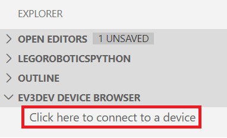
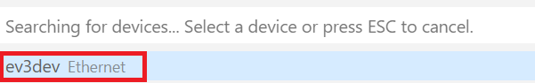
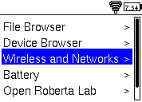
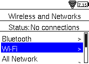
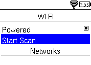
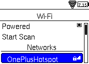
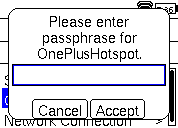
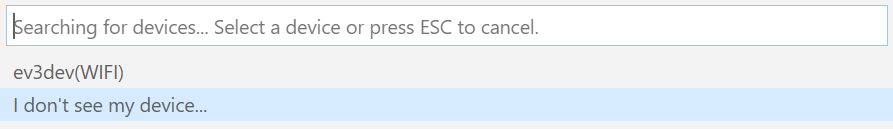
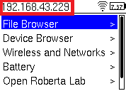

# LEGORoboticsPython
Python für Lego Mindstorm EV3

## Inhalt
* [Installation und Dokumentation](#Installation%20und%20Dokumentation)

## Installation und Dokumentation
[Offizielle Anleitung](https://le-www-live-s.legocdn.com/sc/media/files/ev3-micropython/getting%20started%20with%20micropython_de-3619c654757bdefde79e650951c58d8a.pdf)

[Einführungspräsentation](https://docs.google.com/presentation/d/1aI6rTUCZh44TUXAJdzgp6wt7Sxh3pLjRxMZmbWnKNWI/edit?usp=sharing)

## Voraussetzung
* Visual Studio Code mit der Erweiterung [LEGO® MINDSTORMS® EV3 MicroPython](https://marketplace.visualstudio.com/items?itemName=lego-education.ev3-micropython)
* Einen EV3 mit einer microSD-Karte worauf das [Micropython Image](https://education.lego.com/en-us/support/mindstorms-ev3/python-for-ev3) installiert ist

## Verbindung herstellen
Durch die EV3 MicroPython Erweiterung kann man mit dem EV3DEV Device Browser in Visual Studio Code eine Verbindung mit derm EV3 herstellen.

### USB
Wenn der EV3 über USB verbunden ist, sollte er automatisch erkannt werden.

### WLAN
Um den EV3 über WLAN zu verbinden muss der PC und der EV3 im gleichen Netzwerk sein. Auf dem EV3 kann man sich einfach über das Interface verbinden:

Falls der EV3 weiterhin nicht automatisch erkannt wird, gehe in Visual Studio auf `I don't see my device` und gebe anschließend einen Namen für die Verbindung und die IP-Adresse des EV3 an. 

Die IP-Adresse wird in der oberen linken Ecke des Menüs angezeigt.

