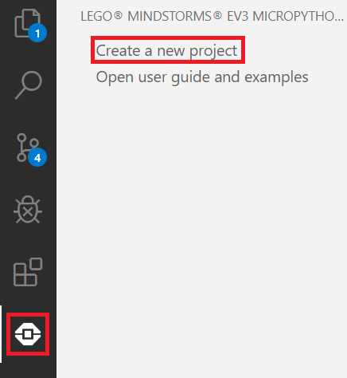

# LEGORoboticsPython
Python für Lego Mindstorm EV3

## Inhalt
* [Installation und Dokumentation](#installation)
* [Voraussetzung](#Voraussetzung)
* [Visual Studio Code Interface](#vscode)
* [Verbindung herstellen](#connection)
  * [USB](#USB)
  * [WLAN](#WLAN)
* [Neues Projekt erstellen](#new_project)
* [Programm ausführen](#execute_program)
* [Motoren](#Motoren)
* [Sensoren](#Sensoren)
  * [Berührungssensor](#Berührungssensor)
  * [Ultraschallsensor](#Ultraschallsensor)
  * [Gyrosensor](#Gyrosensor)
  * [Farbsensor](#Farbsensor)
  * [Inertial Measurement Unit](#imu)
* [Sonsige Funktionen](#other_functions)
* [EV3 Boot Probleme](#boot_problems)
 

  


## Arbeitsplan Praktikum
[Arbeitsplan](https://docs.google.com/document/d/e/2PACX-1vRTPF6EI3NPntP9-wfKK2BqjbzqhgZljUnQAXWiBYso_J3kHYTvZ1trvV-K3ogpHGYAEFRPK_mBcCN5/pub)

<a name="installation"></a>
## Installation und Dokumentation
[Offizielle Anleitung](https://le-www-live-s.legocdn.com/sc/media/files/ev3-micropython/getting%20started%20with%20micropython_de-3619c654757bdefde79e650951c58d8a.pdf) (für zusätzliche Informationen)

[Einführungspräsentation](https://docs.google.com/presentation/d/1aI6rTUCZh44TUXAJdzgp6wt7Sxh3pLjRxMZmbWnKNWI/edit?usp=sharing)

## Voraussetzung
* Visual Studio Code mit der Erweiterung [LEGO® MINDSTORMS® EV3 MicroPython](https://marketplace.visualstudio.com/items?itemName=lego-education.ev3-micropython)
* Einen EV3 mit einer microSD-Karte worauf das [Micropython Image](https://education.lego.com/en-us/support/mindstorms-ev3/python-for-ev3) installiert ist

<a name="vscode"></a>
## Visual Studio Code Interface


<a name="connection"></a>
## Verbindung herstellen
Durch die EV3 MicroPython Erweiterung kann man mit dem EV3DEV Device Browser in Visual Studio Code eine Verbindung mit dem EV3 herstellen.


### USB
Wenn der EV3 über USB verbunden ist, sollte er automatisch erkannt werden.


### WLAN
Um den EV3 über WLAN zu verbinden muss der PC und der EV3 im gleichen Netzwerk sein. Auf dem EV3 kann man sich einfach über das Interface verbinden:


Falls der EV3 weiterhin nicht automatisch erkannt wird, gehe in Visual Studio Code auf `I don't see my device` und gebe anschließend einen Namen für die Verbindung und die IP-Adresse des EV3 an. 


Die IP-Adresse wird in der oberen, linken Ecke des Menüs angezeigt.


<a name="new_project"></a>
## Neues Projekt erstellen
Ein neues Projekt kann man erstellen, indem man auf die EV3 Erweiterung klickt und `Create a new project` auswählt.


In dem neu erstellten Projekt wird automatisch eine main.py Datei angelegt die alle wichtigen Klassen importiert und einen Piepton spielt. Wenn man sich also später keine Gedanken darüber machen möchte welche Klassen man importiert, kann man in jeder Klasse einfach wie in der main.py alles Wichtige importieren:

```
from pybricks import ev3brick as brick
from pybricks.ev3devices import (Motor, TouchSensor, ColorSensor,
                                 InfraredSensor, UltrasonicSensor, GyroSensor)
from pybricks.parameters import (Port, Stop, Direction, Button, Color,
                                 SoundFile, ImageFile, Align)
from pybricks.tools import print, wait, StopWatch
from pybricks.robotics import DriveBase 
```

In der ersten Zeile von jedem Python-Skript muss angegeben werden, welche Version von Python benutzt wird. In diesem Fall ist das also: 

```#!/usr/bin/env pybricks-micropython```

<a name="execute_program"></a>
## Programm ausführen
Wenn der EV3 über USB oder WLAN verbunden ist, kann das Programm oben unter Debug -> Start Debugging ausgeführt werden (Alternativ F5).
Welche Datei ausgeführt wird, kann in /.vscode/launch.json festgelegt werden. Bei einem neuen Projekt wird dort standardmäßig main.py ausgeführt. 
````
{
	"version": "0.2.0",
	"configurations": [
		{
			"name": "Download and Run",
			"type": "ev3devBrowser",
			"request": "launch",
			"program": "/home/robot/${workspaceRootFolderName}/Name_der_auszufuehrenden_Datei.py"
		}
	]
}
````

## Konsolenausgabe
Solange der EV3 mit dem Computer verbunden ist, lassen sich Konsolenausgaben machen. Dies ist sehr wichtig, da es ohne Zwischenausgaben sehr schwer ist zu erkennen an welcher Stelle im Programm der EV3 gerade ist. Dies funktioniert über `print`.
````
# Gibt "hello world" in der Konsole aus. Die Anführungszeichen sind notwendig um zu Kennzeichnen, dass es sich um einen String (Wort) #handelt
print("hello world")

#Deklariere eine Variable alter und setzte sie auf 21
alter = 21

#Gebe die Variable zusammen mit zwei anderen Strings aus. Die Variable ist ein Integer (Zahl), deswegen muss sie mit der str() Methode #in ein String konvertiert werden. Dies wird "Ich bin 21 Jahre alt" ausgeben.
print("Ich bin "+str(alter)+" Jahre alt")
````

<a name="other_functions"></a>
## Brick Funktionen
Der EV3 verfügt über ein Display und einen Lautsprecher. Das ist sehr nützlich um auszugeben an welcher Stelle im Programm er sich gerade befindet. Am einfachsten lässt sich das Display über `display.text()` und der Lautsprecher über `sound.beep()` ansprechen. Die Tasten des EV3 sind sehr nützlich um beispielsweise das Programm zu beenden oder Parameter des Programms während der Laufzeit zu verändern. Die aktivierten Tasten kann man durch `brick.buttons()` bekommen. Mögliche Buttons sind: `LEFT_DOWN, DOWN, RIGHT_DOWN, LEFT, CENTER, RIGHT, LEFT_UP, UP, BEACON, RIGHT_UP`
````
#Püfe ob der untere Button gedrückt wurde
down_pressed = Button.DOWN in brick.buttons()

#Spiele einen Ton
brick.sound.beep()

#Lösche alles was vorher auf dem Display angezeigt wurde
brick.display.clear()

#Zeige den Text "Hallo" auf dem Display and den Koordinaten (0,50)
brick.display.text("Hallo", (0, 50))

# Stelle das Statuslicht auf Rot
brick.light(Color.RED)
````
## Motoren
Um einen Motor zu benutzen muss man zuerst ein Motor-Objekt erstellen und dabei den Port angeben. Für den Port C sieht das dann zum Beispiel so aus: `leftMotor = Motor(Port.C)`. Anschließend kann man mit der `run_target`-Methode den Motor um einen bestimmten Winkel drehen oder mit der `run`-Methode den Motor ohne Begrenzung laufen lassen. Um den Motor wieder anzuhalten, sollte man die `stop`-Methode benutzen.
```
#Motor auf Port C
leftMotor = Motor(Port.C)

# Mit einer Zielgeschwindigkeit von 300 Grad pro Sekunde den Motor um 90 Grad zum Ursprung drehen
leftMotor.run_target(300,90)

#Warte 2 Sekunden
wait(2000)

# Mit einer Zielgeschwindigkeit von 200 Grad pro Sekunde den Motor starten
leftMotor.run(200)

#Warte 2 Sekunden waehrend der Motor laeuft
wait(5000)

#Stoppe den Motor nach 5 Sekunden
leftMotor.stop()
```
## Sensoren
### Berührungssensor
Der Berührungssensor ist der einfachste Sensor. Er kann nur messen ob er gedrückt ist oder nicht.
````
#Touchsensor auf Port 4
touchSensor = TouchSensor(Port.S4)

#Zustand des Berührungssensor lesen
is_pressed = touchSensor.pressed()
````

### Ultraschallsensor
Der Ultraschallsensor misst Entfernungen zwischen 3 und 250cm. Der Messwert wird in Millimeter übergeben.
````
#Ultraschallsensor auf Port 1
ultrasonicSensor =  UltrasonicSensor(Port.S1)

#Gemessene Distanz lesen (in Millimeter)
d=ultrasonicSensor.distance()
````
### Gyrosensor
Der Gyrosensor kann einen Winkel oder eine Winkelgeschwindigkeit messen. Hierbei ist wichtig, dass die Ruhelage(0 Grad) sinnvoll festgelegt ist. Dafür gibt es die Funktion `reset_angle()`.
````
#Gyro Sensor auf Port 4
gyro = GyroSensor(Port.S4)

#Aktuelle Position als Nullposition festlegen
gyro.reset_angle(0)

#aktuellen Winkel lesen
rot = gyro.angle()

#aktuelle Winkelgeschwindigkeit lesen
rot_speed = gyro.speed()
````

### Farbsensor
Der Farbsensor kann verwendet werden um Farben zu erkennen, die Lichtstärke zu messen oder die Stäre der Reflektion von Licht zu messen. 
Bei der Farbmessung muss beachtet werden, dass die gemessene Oberfläche sehr nah vor dem Sensor sein muss. Es können folgende Farben gemessen werden: Color.BLACK, Color.BLUE, Color.GREEN, Color.YELLOW, Color.RED, 
#Color.WHITE, Color.BROWN oder None.
````
#Farbsensor auf Port 1
colorSensor =  ColorSensor(Port.S1)

#Lese aktuellen Farbwert
color = colorSensor.color()

#Reflektion eines roten Lichts auf einer Oberfläche
reflection = colorSensor.reflection()


#Prüfe ob der Sensor Rot gemessen hat
if(color==Color.RED):
    print("Rot")
#Messe die Intensität des Umgebungslichts. (0 bis 100)
amb_light = colorSensor.ambient()
````
<a name="imu"></a>
### Inertial Measurement Unit
Die Inertial Measurement Unit (IMU) kann genauso wie das Gyroskop verwendet werden um Winkel und Winkelgeschwindigkeiten zu messen. Außerdem kann die IMU aber auch Beschleunigungsdaten messen. Da dies kein offizieller Sensor von Lego ist, muss das entsprechende Script aus dem Tools Ordner importiert werden. Wenn IMU.py nicht im gleichen Verzeichnis wie das ausgeführte Programm ist, sollte der Pfad über `sys.path.append()` hinzugefügt werden. Bei der Instanziierung muss festgelegt werden welcher Modus benutzt wird. Mögliche Modi sind:  TILT, ACCEL, COMPASS, MAG, GYRO. COMPASS ist der einzige Modus indem nur ein Messwert übergeben wird. Hier wird ähnlich wie beim Gyrosensor nur ein Winkel zwischen 0 und 360 Grad gemessen. Alle anderen Modi übergeben drei Messwerte. In TILT sind das die Winkel für X,Y und Z-Achse, in ACCEL die entsprechenden Beschleunigungsdaten, MAG misst das magnetische Feld und GYRO sind die Winkelgeschwindigkeiten. Mehr Informationen zu den Modi gibt es [hier](http://docs.ev3dev.org/projects/lego-linux-drivers/en/ev3dev-stretch/sensor_data.html).

````
#Fuege den Tools Ordner zum PYTHONPATH hinzu. Nicht notwendig wenn IMU.py im selben Ordner ist
import sys
sys.path.append("/home/robot/LEGORoboticsPython/Tools")

#Importiere IMU.py
from IMU import IMU

#Port und Mode des Seonsors festlegen. Moegliche Modes sind TILT, ACCEL, COMPASS, MAG, GYRO
imu = IMU(Port.S3, 'GYRO')

#Speichere die aktuellen Messdaten in result
result = imu.angle()
````


<a name="boot_problems"></a>
# EV3 Boot Probleme
Manchmal bleibt der EV3 beim Starten hängen. Dies passiert vermutlich weil der Akku leer ist, also sollte der EV3 zunächst mit dem Aufladegerät verbunden werden. Dann muss die SD-Karte auf der linken Seite des Bricks entfernt werden. Hier ist das Betriebssystem was wir benutzen gespeichert und wenn wir diese entfernen wird wieder das Standardbetriebssystem benutzt. Um den EV3 jetzt neu zustarten muss die Mittlere- und die Zurück-Taste (oben links) gleichzeitig für mehrere Sekunden gedrückt werden. Nachdem der EV3 gestartet ist, kann er gleich wieder runtergefahren werden (Zurück-Taste). Dann kann die SD-Karte wieder eingesetzt werden und der EV3 sollte anschließend normal starten.
